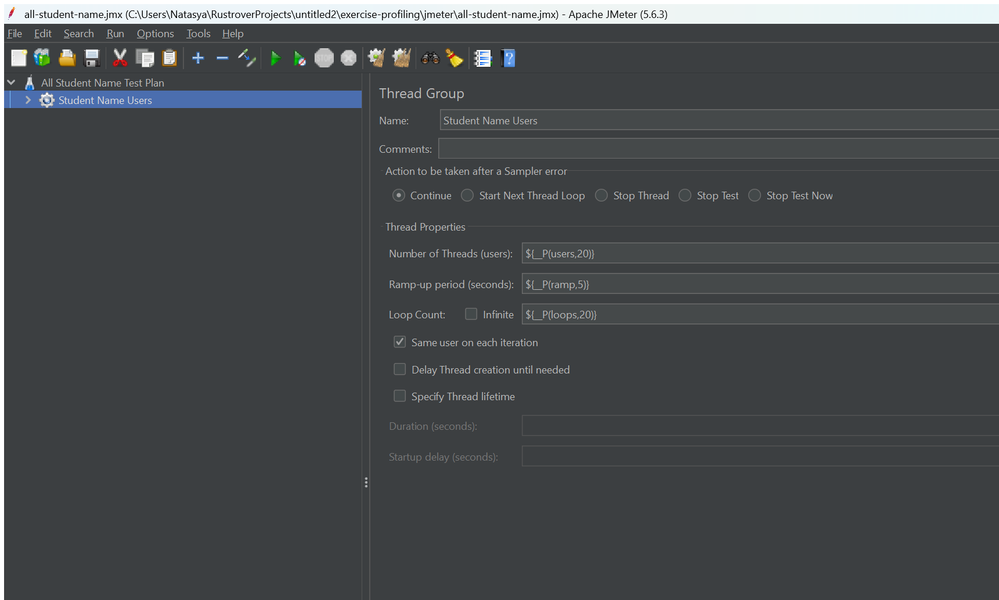
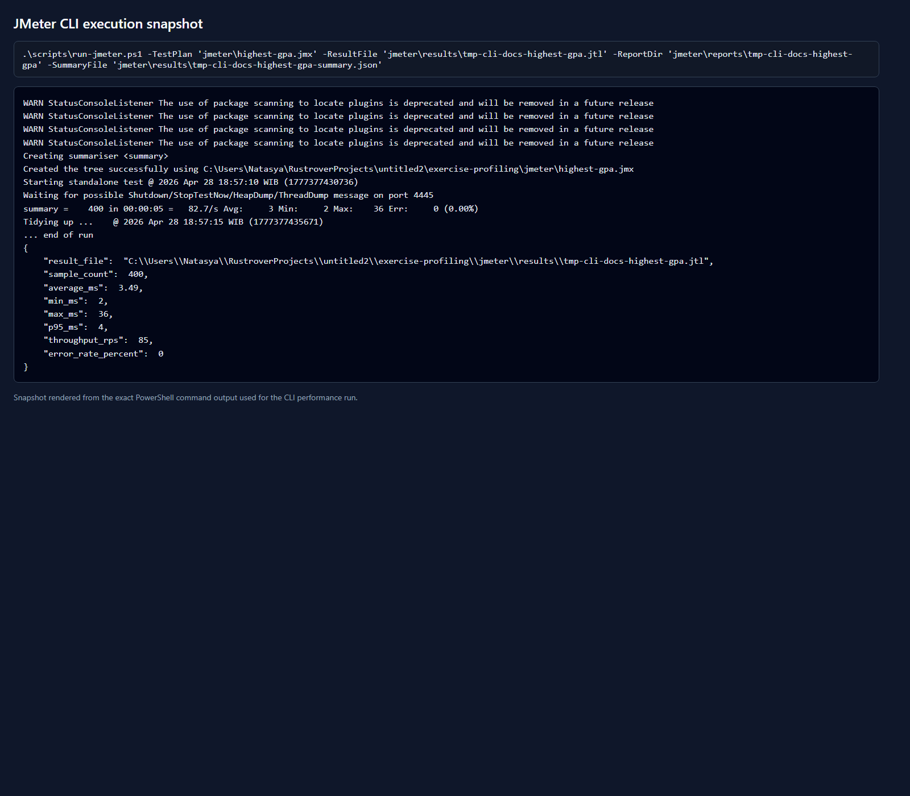
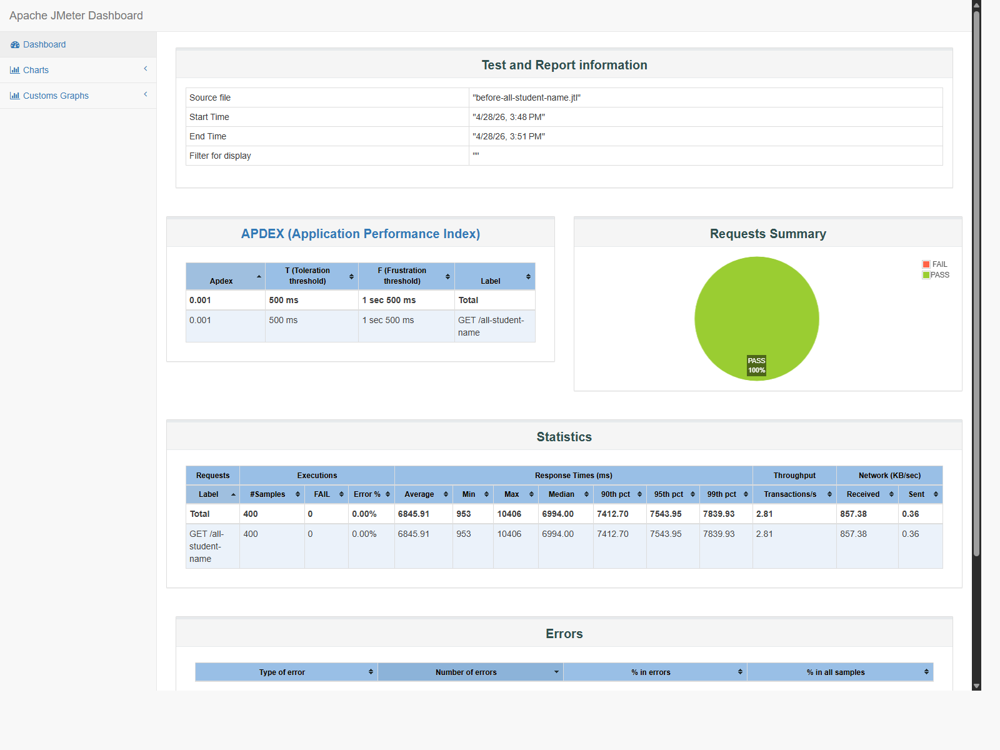
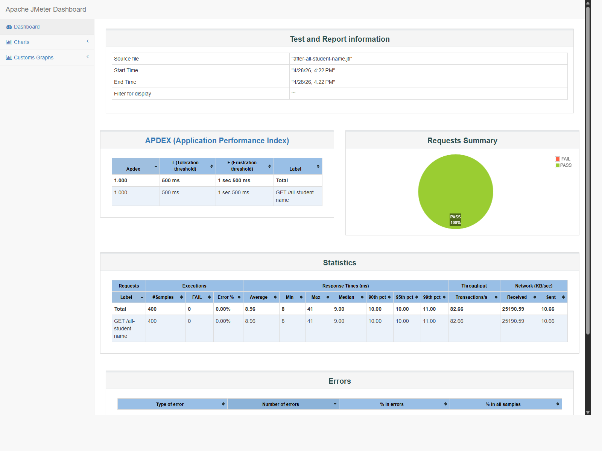

# Exercise Profiling

## Project Setup

1. Use JDK 17 or JDK 21.
2. Configure PostgreSQL in `src/main/resources/application.properties`.
3. Run `./mvnw.cmd install`.
4. Run the application with `./mvnw.cmd spring-boot:run` or IntelliJ IDEA.
5. Seed the data:
   - `http://localhost:8080/seed-data-master`
   - `http://localhost:8080/seed-student-course`

This repository was prepared with PostgreSQL defaults:

- Database: `advpro-2024`
- Username: `postgres`
- Password: `my-password`

Optional environment overrides:

- `PROFILING_DB_URL`
- `PROFILING_DB_USERNAME`
- `PROFILING_DB_PASSWORD`

## Running the Application

PowerShell:

```powershell
$env:JAVA_HOME='C:\Program Files\Java\jdk-21'
.\mvnw.cmd spring-boot:run
```

If you want a repo-local PostgreSQL instance instead of a system installation, use the helper scripts in [`scripts/`](scripts).

## Seed Data

After the application is running:

1. Open `http://localhost:8080/seed-data-master`
2. Open `http://localhost:8080/seed-student-course`

## JMeter

Prepare local JMeter:

```powershell
.\scripts\setup-jmeter.ps1
```

Open JMeter GUI:

```powershell
.\tools\jmeter\apache-jmeter-5.6.3\bin\jmeter.bat
```

Run baseline from CLI:

```powershell
.\scripts\run-jmeter.ps1 -TestPlan 'jmeter\all-student-name.jmx' -ResultFile 'jmeter\results\before-all-student-name.jtl' -ReportDir 'jmeter\reports\before-all-student-name' -SummaryFile 'jmeter\results\before-all-student-name-summary.json'
.\scripts\run-jmeter.ps1 -TestPlan 'jmeter\highest-gpa.jmx' -ResultFile 'jmeter\results\before-highest-gpa.jtl' -ReportDir 'jmeter\reports\before-highest-gpa' -SummaryFile 'jmeter\results\before-highest-gpa-summary.json'
```

Additional baseline for `/all-student`:

```powershell
.\scripts\run-jmeter.ps1 -TestPlan 'jmeter\all-student.jmx' -ResultFile 'jmeter\results\before-all-student.jtl' -ReportDir 'jmeter\reports\before-all-student' -SummaryFile 'jmeter\results\before-all-student-summary.json'
```

The CLI runner also generates an HTML dashboard under `jmeter/reports/`, but that folder is treated as local generated output and is not committed.

Representative screenshots are committed under `docs/screenshots/` so the README still contains visual evidence even when local JMeter dashboards are regenerated.

### Screenshot Evidence

JMeter GUI test plan for `/all-student-name`:



JMeter CLI execution snapshot for `/highest-gpa`:



The CLI image above is rendered from the exact PowerShell output of the JMeter run so the command and summary remain readable in the repository.

## Baseline Performance Result

Seeded dataset:

- 20,000 students
- 10 courses
- 2 course mappings per student

Baseline result before optimization:

| Endpoint | Avg response time (ms) | Throughput (req/s) | Error rate | Evidence |
| --- | ---: | ---: | ---: | --- |
| `/all-student-name` | 6845.91 | 2.81 | 0% | `jmeter/results/before-all-student-name.jtl`, `jmeter/results/before-all-student-name-summary.json` |
| `/highest-gpa` | 34.59 | 76.80 | 0% | `jmeter/results/before-highest-gpa.jtl`, `jmeter/results/before-highest-gpa-summary.json` |
| `/all-student` | 40091.67 | 0.05 | 0% | `jmeter/results/before-all-student.jtl`, `jmeter/results/before-all-student-summary.json` |

Baseline dashboard screenshot for `/all-student-name`:



This screenshot is a representative baseline dashboard. Raw baseline files for all measured endpoints remain listed in the table above.

## Profiling Findings

Profiling evidence is stored under `profiling/` as JFR summaries and execution-sample dumps that can be reviewed without the IntelliJ UI.

| Endpoint | Primary hotspot | Finding | Evidence |
| --- | --- | --- | --- |
| `/all-student` | Hibernate JDBC execution and repeated repository access | `getAllStudentsWithCourses()` loads all students, then calls `findByStudentId()` once per student, which creates an N+1 query pattern and additional object copying. | `profiling/all-student-summary.txt`, `profiling/all-student-hotspots.txt`, `profiling/findings.md` |
| `/highest-gpa` | Full table fetch before in-memory scan | `findStudentWithHighestGpa()` reads the entire `students` table with `findAll()` even though the endpoint only needs one row. | `profiling/highest-gpa-summary.txt`, `profiling/highest-gpa-hotspots.txt`, `profiling/findings.md` |
| `/all-student-name` | Repeated string allocation in request thread | `joinStudentNames()` performs repeated immutable string concatenation, and JFR shows `StringConcatHelper` dominating sampled request stacks. | `profiling/all-student-name-summary.txt`, `profiling/all-student-name-hotspots.txt`, `profiling/findings.md` |

## Optimization Changes

### `/all-student`

- Initial problem: `StudentService.getAllStudentsWithCourses()` loaded all students first, then queried student-course rows once per student, causing an N+1 pattern and unnecessary object recreation.
- Change: added `StudentCourseRepository.findAllWithStudentAndCourse()` with `join fetch` for both `student` and `course`, then returned that list directly from the service.
- Reason: the endpoint only needs the final student-course list, so one joined query is cheaper than one query per student and avoids rebuilding `StudentCourse` objects in Java.
- Result:
  - Before average response time: `40091.67 ms`
  - After average response time: `248.50 ms`
  - Improvement: `99.38%`
  - Throughput before/after: `0.05 req/s` -> `5.91 req/s`
  - Evidence: `jmeter/results/before-all-student-summary.json`, `jmeter/results/after-all-student-summary.json`

### `/highest-gpa`

- Initial problem: `findStudentWithHighestGpa()` fetched the entire `students` table and searched the maximum GPA in application memory.
- Change: added `StudentRepository.findFirstByOrderByGpaDescIdAsc()` and returned it directly from the service.
- Reason: the endpoint only needs one row, so sorting and limiting should happen in the database where the data already lives.
- Result:
  - Before average response time: `34.59 ms`
  - After average response time: `4.03 ms`
  - Improvement: `88.35%`
  - Throughput before/after: `76.80 req/s` -> `84.78 req/s`
  - Evidence: `jmeter/results/before-highest-gpa-summary.json`, `jmeter/results/after-highest-gpa-summary.json`

### `/all-student-name`

- Initial problem: `joinStudentNames()` loaded full `Student` entities and built the response with repeated `result += ...` concatenation.
- Change: added `StudentRepository.findAllNamesOrderById()` to fetch only the `name` column, then joined the names with `String.join(", ", ...)`.
- Reason: the endpoint only needs student names, so there is no value in hydrating entire entities or reallocating the whole response string on every loop iteration.
- Result:
  - Before average response time: `6845.91 ms`
  - After average response time: `8.96 ms`
  - Improvement: `99.87%`
  - Throughput before/after: `2.81 req/s` -> `82.66 req/s`
  - Evidence: `jmeter/results/before-all-student-name-summary.json`, `jmeter/results/after-all-student-name-summary.json`

## After Optimization Result

| Endpoint | Avg response time (ms) | Throughput (req/s) | Error rate | Evidence |
| --- | ---: | ---: | ---: | --- |
| `/all-student` | 248.50 | 5.91 | 0% | `jmeter/results/after-all-student.jtl`, `jmeter/results/after-all-student-summary.json` |
| `/highest-gpa` | 4.03 | 84.78 | 0% | `jmeter/results/after-highest-gpa.jtl`, `jmeter/results/after-highest-gpa-summary.json` |
| `/all-student-name` | 8.96 | 82.66 | 0% | `jmeter/results/after-all-student-name.jtl`, `jmeter/results/after-all-student-name-summary.json` |

Re-measurement dashboard screenshot after optimization for `/all-student-name`:



This screenshot is a representative post-optimization dashboard. Raw after-optimization files for all measured endpoints remain listed in the table above.

## Before vs After Comparison

| Endpoint | Before avg (ms) | After avg (ms) | Improvement | Throughput before | Throughput after | Conclusion |
| --- | ---: | ---: | ---: | ---: | ---: | --- |
| `/all-student` | 40091.67 | 248.50 | 99.38% | 0.05 | 5.91 | N+1 query removal was the dominant win. |
| `/highest-gpa` | 34.59 | 4.03 | 88.35% | 76.80 | 84.78 | Database-side limit removed unnecessary table scan in Java. |
| `/all-student-name` | 6845.91 | 8.96 | 99.87% | 2.81 | 82.66 | Fetching only names and using one join operation removed allocation overhead. |

## Reflection

1. JMeter measures external behavior under load, such as latency, throughput, and error rate. Profiling focuses on what the JVM is doing inside one process, such as hot methods, object allocation, and time spent in framework or database access code.
2. Profiling narrows a slow endpoint to specific execution paths. In this project it showed whether time was dominated by Hibernate query execution, repeated string allocation, or application-side loops.
3. Yes. IntelliJ Profiler is effective because it gives method-level hotspots quickly, especially for endpoints that are clearly CPU-heavy or allocation-heavy. For this repository, the same hotspot patterns were obvious in profiling artifacts: `StringConcatHelper` for `/all-student-name`, Hibernate query execution for `/all-student`, and full-table loading for `/highest-gpa`.
4. The main challenge is getting stable measurements. Warm-up effects, existing result files, and database state can distort conclusions. I handled that by using one seeded dataset, reusing the same JMeter plans, and regenerating result files cleanly for each comparison.
5. The biggest benefit is faster root-cause isolation. Instead of only knowing that an endpoint is slow, profiling shows which methods and framework layers are consuming time or memory.
6. When profiler findings and JMeter numbers do not line up exactly, I treat them as complementary signals. JMeter may reflect contention, HTTP overhead, and database variability, while profiling shows a sample of runtime internals. The fix is to repeat tests on the same dataset, correlate both results, and optimize only the bottleneck that appears in both views.
7. The strategy was to push data reduction closer to the database, remove repeated work, and avoid avoidable allocations. I kept changes narrow, reran JMeter after each optimization, and ran Maven tests/builds so the performance fixes did not change endpoint behavior or break the application.

## Important PRs and Commits

| Branch | PR | Important commit |
| --- | --- | --- |
| `milestone-1-project-setup` | `#1` | `[Setup] - Configure PostgreSQL and project properties` |
| `milestone-2-initial-jmeter-tests` | `#2` | `[Testing] - Add initial JMeter performance baseline` |
| `milestone-3-intellij-profiling` | `#3` | `[Profiling] - Record endpoint profiling findings` |
| `milestone-4-optimize-all-student` | `#4` | `[Refactoring] - Optimize all student query` |
| `milestone-5-optimize-highest-gpa` | `#5` | `[Refactoring] - Optimize highest GPA endpoint` |
| `milestone-6-optimize-all-student-name` | `#6` | `[Refactoring] - Optimize all student name endpoint` |
| `milestone-7-readme-reflection` | `#7` | `[Docs] - Add performance comparison and reflection` |

## Progress

- [x] Setup project and PostgreSQL configuration
- [x] Add JMeter baseline
- [x] Record profiling findings
- [x] Optimize `/all-student`
- [x] Optimize `/highest-gpa`
- [x] Optimize `/all-student-name`
- [x] Document comparison and reflection
